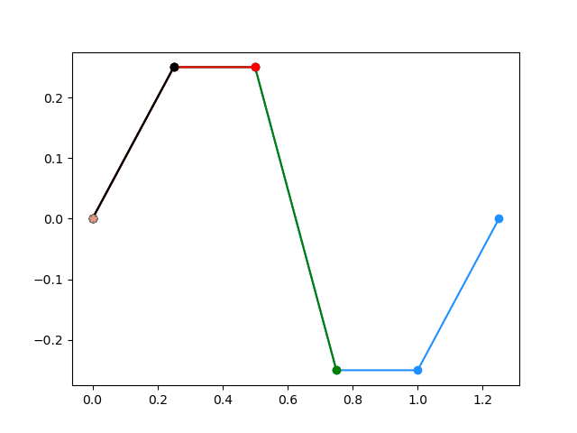

# NURBS
NURBS - non-uniform rational basis spline.
## What is done
A simple implementation of the de Boor algorithm for building NURBS.
A simple visualization of NURBS construction is also made.
## Why is it done
This work is done in order to try yourself in visualization of spline. 
And of course, to pass the subject successfully.
## How to test
* Clone repository
* Open this project in Python IDE
* Go to function `main` in main.py
* There you will find some examples of work.
* Choose a ready-made example or create your own
* Have fun with amazing visualization
## Example of how the algorithm works
#### heart curve

#### short wave curve

#### rounding curve

#### wave curve
